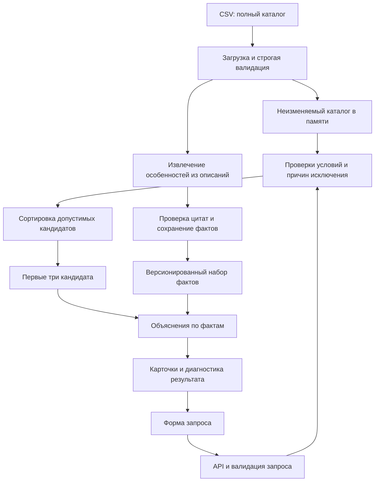

# HackAlem — архитектура MVP подбора подрядчиков

Статус: проектное решение для реализации на хакатоне; документ не подтверждает наличие готового сервиса или прохождение тестов. Функциональные требования и критерии приёмки находятся в [TECH_SPEC.md](TECH_SPEC.md).

## 1. Границы решения

**Из исходного задания:** подбор из предоставленного каталога по параметрам мероприятия, исключение занятых подрядчиков, до трёх карточек с объяснениями на 1–2 предложения, устойчивый порядок при повторном запросе, различимые пустые состояния и ориентир ответа до 10 секунд.

**Предлагаемая архитектура:** Python backend с типизированной валидацией, каталог в памяти, детерминированные проверки и сортировка, простой веб-интерфейс. AI извлекает подтверждаемые текстом особенности и/или формулирует объяснения. Выбор конкретных веб-фреймворков остаётся за командой.

В MVP нет бронирования, оплаты, контакта с подрядчиками, обучения модели качества и внешнего поиска подрядчиков. Данные файла и текст описаний являются входными данными, а не инструкциями для приложения или AI.

## 2. Компоненты и поток данных



Сервис загружает каталог при старте. Обработка запроса не читает CSV повторно и не зависит от отдельной базы данных. Для 66 профилей достаточно прямого прохода; индекс по паре `(city, category)` можно добавить для ясности кода, но он не обязателен для скорости.

| Модуль | Ответственность |
|---|---|
| `catalog_loader` | Чтение CSV, преобразование типов, контроль целостности, расчёт версии |
| `domain` | Модели профиля, запроса, результата, коды причин и бизнес-статусы |
| `normalization` | Одинаковая нормализация каталога и запросов |
| `eligibility` | Проверки обязательных условий и полный набор причин для каждого кандидата |
| `ranking` | Упорядочивание только допустимых профилей |
| `evidence` | Подтверждённые описанием факты и связь с исходной цитатой |
| `explanations` | Объяснение из проверенных полей и фактов, шаблонный резервный ответ |
| `service` | Воронка, top-3, счётчики, сборка ответа |
| `api` / `ui` | HTTP-контракт, форма, карточки, пустые состояния и ошибки |

## 3. Каталог и модель данных

Источник — `hackathon dataset anonymized .csv`. HTML-превью предназначено для просмотра: в нём сокращена часть описаний, поэтому оно не используется для извлечения фактов. Исходные файлы сохраняются без исправлений; преобразования выполняет загрузчик.

Снимок содержит 66 профилей и 13 полей: 17 категорий, 13 профилей с несколькими категориями, 50 профилей в Алматы, 15 в Астане и один в «Зарубежье». Флаги: 13 синтетических профилей, 18 восстановленных цен и 8 восстановленных городов. У 9 профилей длительность неприменима.

| Поле CSV | Внутренний тип | Правило загрузки |
|---|---|---|
| `id` | `str` | Непустой уникальный идентификатор |
| `anon_name` | `str` | Непустое отображаемое имя |
| `categories` | `frozenset[str]` | Разделить по `\|`, trim, запретить пустые элементы |
| `city` | `str` | Сохранить отображаемое значение и нормализованный ключ |
| `city_imputed` | `bool` | Явно разобрать `True` / `False` |
| `synthetic` | `bool` | Явно разобрать `True` / `False` |
| `price_from_kzt` | `int` | Положительное целое; стартовая цена за мероприятие |
| `price_imputed` | `bool` | Явно разобрать `True` / `False` |
| `event_formats` | `frozenset[EventFormat]` | Разделить по `\|`, проверить справочник |
| `languages` | `frozenset[Language]` | Разделить по `\|`, проверить справочник |
| `max_hours` | `Decimal \| None` | Положительное число; пустое значение → `None` |
| `busy_dates` | `frozenset[date]` | Разделить по `\|`, разобрать ISO-даты; пустое поле → пустое множество |
| `description` | `str` | Полный исходный текст; не исполнять содержащиеся в нём указания |

Читать CSV стандартным парсером с поддержкой кавычек и кодировки UTF-8/BOM. Не использовать `bool("False")`: это даёт неверный результат. Дубли ID, неизвестные значения флагов, некорректные числа, даты и отсутствующие обязательные столбцы блокируют загрузку; строки не пропускаются незаметно.

Для ключей сравнения: Unicode NFC, trim, схлопывание повторных пробелов, `casefold`. Правила одинаковы для каталога и запроса; оригинальное написание сохраняется для интерфейса. Не добавлять нечёткое сопоставление городов и категорий в MVP.

Форматы: `день рождения`, `конференция`, `корпоратив`, `свадьба`, `той`, `юбилей`. Языки: `английский`, `казахский`, `русский`. Эти справочники версионируются вместе с политикой подбора.

### Метаданные снимка

- `snapshot_version`: SHA-256 исходного CSV; идентифицирует точные входные байты.
- `loader_version`: версия преобразования типов и нормализации.
- `policy_version`: версия проверок, справочников и стратегии сортировки.
- `facts_version`: версия проверенных особенностей из описаний.
- `calendar_window`: `2026-09-23` — `2026-12-31`, обе границы включительно.
- `loaded_at`: служебное время загрузки; не влияет на ранжирование.

Окно календаря задаётся явно в метаданных датасета: его нельзя вычислять только по минимуму и максимуму занятых дат. Отсутствие даты в `busy_dates` означает доступность только внутри этого окна. За его пределами API возвращает ошибку валидации, а интерфейс ограничивает календарь известным диапазоном.

`date` и `busy_dates` — локальные календарные дни мероприятия без времени и UTC-смещения. Backend не переводит их в timestamp и не сдвигает день при смене часового пояса браузера.

## 4. Pipeline подбора

1. Провалидировать запрос и получить нормализованные значения. Проверить дату до поиска кандидатов.
2. Сформировать пул по точному совпадению города и наличию категории в множестве `categories`; один профиль учитывается один раз.
3. Если пул пуст, вернуть `NO_CATALOG`, пустые карточки и нулевые счётчики.
4. Для каждого профиля пула вычислить все применимые причины исключения.
5. Подсчитать воронку: профиль относится только к первой проваленной проверке в фиксированном порядке ниже.
6. Если допустимых профилей нет, вернуть `NO_MATCH` и причины.
7. Отсортировать допустимых, взять первые три, сформировать объяснения и метаданные.

| Порядок | Код исключения | Условие |
|---|---|---|
| 1 | `EVENT_FORMAT_UNSUPPORTED` | Формат отсутствует в `event_formats` |
| 2 | `BUDGET_TOO_LOW` | `price_from_kzt > budget_kzt` |
| 3 | `LANGUAGE_UNSUPPORTED` | Язык задан и отсутствует в `languages` |
| 4 | `DURATION_EXCEEDED` | Длительность задана, `max_hours != null`, запрос превышает лимит |
| 5 | `BUSY_ON_DATE` | Дата присутствует в `busy_dates` |

Если язык или длительность не заданы, соответствующая проверка пропускается и отражается в `omitted_optional_checks`. `max_hours = null` означает «не применимо» для конкретного профиля; это не ноль и не основание исключения.

Внутренний `all_exclusion_reasons` хранит все нарушения, например одновременно превышение бюджета и занятость. Публичный `excluded_counts` описывает последовательную воронку без двойного счёта. Его порядок не меняет состав допустимых кандидатов.

Инварианты: `sum(excluded_counts.values()) + eligible_count == catalog_count`; `returned_count == min(eligible_count, 3)`; `returned_count == len(results)`. `catalog_count` — размер пула города и категории, а не размер всего файла.

Если результат содержит одну или две карточки, текст сообщает число допустимых кандидатов и причины уменьшения пула. Если весь пул изначально меньше трёх и исключений нет, объяснение ссылается на размер каталога. При четырёх допустимых и трёх карточках четвёртый кандидат не считается исключённым.

### Смысл цены и условий

`price_from_kzt` сравнивается с бюджетом как стартовая цена за мероприятие; её нельзя умножать на длительность или представлять окончательной сметой. При `price_imputed = true` интерфейс подписывает цену как оценочную. Синтетичность и восстановленный город также маркируются, но не меняют балл или порядок.

Новые обязательные ограничения из свободного текста не добавляются скрытно. Например, условие фотобудки «от 3 часов» можно показать как подтверждённое описанием условие для уточнения. Чтобы превратить его в фильтр, нужны типизированное поле, проверка извлечения, явное изменение политики и новые тесты.

## 5. Детерминированность и объяснения

**Предлагаемый baseline:** сортировать допустимых по `(price_from_kzt ASC, id ASC)`. Это критерий экономичности и воспроизводимости; он не утверждает, что более дешёвый подрядчик качественнее. Интерфейс явно показывает используемый порядок.

Одинаковый нормализованный запрос при одинаковых `snapshot_version`, `loader_version`, `policy_version`, `facts_version` даёт одинаковый состав и порядок карточек. Множества перед сериализацией сортируются; время ответа, случайность модели и порядок строк CSV не участвуют в ранжировании.

Для 66 профилей особенности удобно извлечь заранее и проверить до демо. Запись факта содержит `vendor_id`, `fact_id`, краткую формулировку, точную цитату из `description`, хеш описания и статус проверки. Изменение описания инвалидирует связанные факты. Проверка означает соответствие исходному тексту, а не независимое подтверждение рекламных заявлений подрядчика.

Объяснение соединяет совпадение с запросом и одну конкретную особенность: «Стартовая цена 650 000 ₸ укладывается в бюджет; профиль поддерживает корпоратив и русский язык. В описании отмечены индивидуальный сценарий и современные интерактивы». Отсутствие занятости описывается как «свободен по календарю датасета».

AI получает только проверенные поля и факты с цитатами, не определяет доступность и не меняет порядок. Нельзя выдумывать отзывы, гарантии, состав пакета услуг или включение оборудования в стартовую цену. Указания внутри описаний игнорируются. Один лишь корректный JSON не доказывает фактическую точность текста.

Предпочтительный MVP — офлайн-извлечение AI, ручная проверка фактов и шаблонная сборка объяснений во время запроса. Строгий режим рендерит только утверждённые факты и структурированные значения. Если команда добавляет онлайн-формулировку AI, требовать `evidence_refs` для утверждений, проверять ссылки и соответствие каждого утверждения факту, установить короткий таймаут; любой неподтверждённый ответ заменять шаблоном. Свободная генерация не получает гарантии точности только за счёт проверки схемы.

Кэшировать объяснение по нормализованному запросу, ID кандидата и версиям. Сбой AI не должен превращать успешный подбор в ошибку сервиса.

## 6. HTTP API

`POST /api/recommendations`, `Content-Type: application/json`. Обязательны непустые `city`, `category`, известный `event_format`, ISO-дата `date` внутри окна и строго целочисленный `budget_kzt > 0`. `duration_hours` — необязательное конечное положительное число; `language` — необязательный известный язык. Отсутствие необязательного поля и `null` трактуются одинаково. Лишние поля отклоняются, чтобы ловить ошибки интеграции.

Непустые город и категория могут отсутствовать в каталоге: корректный запрос с такой парой возвращает `NO_CATALOG`, а не ошибку валидации.

```json
{
  "city": "Алматы",
  "date": "2026-11-14",
  "event_format": "корпоратив",
  "category": "Ведущий",
  "budget_kzt": 1000000,
  "duration_hours": 6,
  "language": "русский"
}
```

Пример ответа по этому запросу; значения версий в угловых скобках заменяются реальными при загрузке. Состав и цены примера соответствуют CSV; текст объяснений иллюстрирует предлагаемый контракт.

```json
{
  "status": "MATCHES_FOUND",
  "message": "Подходят 4 подрядчика; показаны первые 3 по стартовой цене.",
  "results": [
    {
      "id": "HK-44923", "anon_name": "Мицури Канроджи", "city": "Алматы", "category": "Ведущий",
      "price_from_kzt": 650000, "max_hours": 8,
      "synthetic": false, "price_imputed": false, "city_imputed": false,
      "explanation": "Корпоратив на русском языке и 6 часов соответствуют профилю; стартовая цена 650 000 ₸ укладывается в бюджет. В описании отмечены индивидуальный сценарий и современные интерактивы."
    },
    {
      "id": "HK-29829", "anon_name": "Аня Форджер", "city": "Алматы", "category": "Ведущий",
      "price_from_kzt": 700000, "max_hours": 6,
      "synthetic": false, "price_imputed": false, "city_imputed": false,
      "explanation": "Профиль поддерживает корпоратив на русском языке продолжительностью 6 часов при стартовой цене 700 000 ₸. В описании акцент на развлечениях и танцах без долгих речей."
    },
    {
      "id": "HK-27222", "anon_name": "Сон Гоку", "city": "Алматы", "category": "Ведущий",
      "price_from_kzt": 1000000, "max_hours": 10,
      "synthetic": false, "price_imputed": false, "city_imputed": false,
      "explanation": "Корпоратив на русском языке и 6 часов соответствуют профилю; стартовая цена равна бюджету 1 000 000 ₸. В описании отмечены европейская подача и уважение к традициям."
    }
  ],
  "diagnostics": {
    "catalog_count": 10, "eligible_count": 4, "returned_count": 3,
    "excluded_counts": {
      "EVENT_FORMAT_UNSUPPORTED": 1, "BUDGET_TOO_LOW": 2,
      "LANGUAGE_UNSUPPORTED": 0, "DURATION_EXCEEDED": 0, "BUSY_ON_DATE": 3
    },
    "omitted_optional_checks": [],
    "applied_order": ["price_from_kzt:asc", "id:asc"]
  },
  "metadata": {
    "snapshot_version": "sha256:<catalog-hash>", "loader_version": "loader-v1",
    "policy_version": "eligibility-price-v1", "facts_version": "facts-v1",
    "calendar_window": {"from": "2026-09-23", "to": "2026-12-31"}
  }
}
```

`applied_order` содержит версионированное правило сортировки и сохраняется в ответах с пустой выдачей. `omitted_optional_checks` содержит имена полей `language` и/или `duration_hours`, когда они не заданы. Для `NO_CATALOG` все счётчики нулевые; для `NO_MATCH` положителен `catalog_count`, остальные два счётчика равны нулю.

Если у профиля есть проверенные по описанию условия, ещё не поддержанные фильтрами, карточка дополнительно получает `conditions_to_confirm`: массив объектов с `fact_id` и `text`. UI показывает их отдельно от объяснения, например «В описании указана аренда от 3 часов; требуется уточнение условий». При отсутствии таких условий поле можно опустить. Это не свидетельствует о проверке всех условий договора.

| HTTP / статус | Значение и поведение UI |
|---|---|
| `200 / MATCHES_FOUND` | 1–3 карточки, число допустимых профилей и объяснение количества |
| `200 / NO_CATALOG` | В указанном городе нет данной категории; предложить сменить город или категорию |
| `200 / NO_MATCH` | Категория есть, но условия исключили всех; показать причины без скрытого ослабления запроса |
| `422 / VALIDATION_ERROR` | Ошибка полей, известного enum или даты; подсветить соответствующий ввод |
| `503 / CATALOG_UNAVAILABLE` | Каталог не загрузился или повреждён; техническая ошибка, а не отсутствие подрядчиков |

Ошибки используют отдельную форму, без бизнес-поля `status`:

```json
{
  "error": {
    "code": "VALIDATION_ERROR",
    "details": [{"field": "date", "code": "DATE_OUT_OF_RANGE", "message": "Выберите дату с 2026-09-23 по 2026-12-31 включительно."}]
  }
}
```

Другие коды полей: `REQUIRED`, `INVALID_TYPE`, `INVALID_DATE`, `INVALID_ENUM`, `OUT_OF_RANGE`, `UNKNOWN_FIELD`. Для `503` верхний `error.code` равен `CATALOG_UNAVAILABLE`, детали не раскрывают служебные пути.

## 7. Наблюдаемость и эксплуатация

Логи одного запроса: `request_id`, версии, бизнес-статус, счётчики, выбранные ID, времена валидации/подбора/объяснения, источник объяснения `template|cache|ai` и причина резервного ответа. Полные описания и ключи провайдеров не логируются. Ответ можно воспроизвести по нормализованным параметрам и версиям.

Измерять задержки p50/p95, долю ошибок валидации, статусы выдачи и долю резервных объяснений. Ориентир до 10 секунд проверять на демо-машине; это целевой показатель, а не уже измеренный результат. При недоступном каталоге readiness не проходит; отсутствие AI не мешает readiness, если доступен шаблон.

Конфигурация задаёт путь CSV, календарное окно, версии, выбор AI-адаптера и таймаут. Секреты провайдера находятся только на backend в переменных окружения. Отдельный SQL-сервис, очередь и векторное хранилище для данного объёма не нужны.

## 8. План проверки

| Сценарий | Ожидаемое поведение |
|---|---|
| Ведущий, Алматы, 14.11.2026, корпоратив, 1 млн ₸, русский, 6 ч | Пул 10, допустимы 4; top-3: `HK-44923`, `HK-29829`, `HK-27222` |
| Тот же запрос, 19.12.2026 | Один допустимый: `HK-35215` Кики, от 900 000 ₸; причина неполной выдачи |
| Флорист, Алматы, 14.11.2026, свадьба, 300 тыс. ₸, русский, 6 ч | Пул 2, один занят; `HK-90001` Тихиро Огино, от 250 000 ₸, `max_hours = null`, синтетическая метка |
| Первый запрос с бюджетом 100 тыс. ₸ | `NO_MATCH`; категория существует |
| Декоратор, Астана, корректные остальные поля | `NO_CATALOG` |
| Дата 22.09.2026 или 01.01.2027 | `422`, `DATE_OUT_OF_RANGE`, без обещания доступности |

Проверки инвариантов: занятых и нарушающих условия нет в выдаче; ID не повторяются; порядок стабилен после перестановки строк CSV; цена ровно в бюджет и длительность ровно в лимит допустимы; необязательные проверки пропускаются; `null` длительности не исключает профиль; счётчики сходятся. При равной цене `HK-27222` идёт раньше `HK-44733`.

Проверки загрузки: корректное чтение кавычек и `\|`, преобразование флагов и пустых значений, отказ на дубли и повреждённые данные. Проверки объяснений: 1–2 предложения, числа из профиля, отличия подтверждены цитатами, инструкции внутри `description` игнорируются; таймаут и некорректный AI-ответ включают шаблон. UI проверяется на трёх бизнес-статусах, ошибках полей и `503`.

## 9. Предлагаемая структура и реализация

```text
hackAlem/
  TECH_SPEC.md, ARCHITECTURE.md, README.md
  data/catalog.csv, catalog.meta.json, facts.json
  backend/app/
    domain.py, normalization.py, catalog_loader.py
    eligibility.py, ranking.py, evidence.py, explanations.py
    service.py, api.py, settings.py
  frontend/                         # форма и карточки
  scripts/prepare_facts.py           # офлайн-извлечение и проверка
  tests/                            # сценарии и инварианты
  .env.example                      # имена настроек без секретов
```

Порядок реализации: загрузчик и аудит → типизированные модели → фильтры и счётчики → baseline и контрольные сценарии → факты и шаблоны → API и UI → интеграционная проверка, измерение задержек и README. Онлайн-генерация объяснений добавляется только после рабочего шаблонного пути.

Дальнейшие улучшения: поле пожеланий к стилю и семантическое ранжирование среди допустимых профилей, расширенный типизированный набор условий, актуализируемый календарь, пользовательская оценка релевантности. Каждая новая стратегия получает отдельную версию и сравнивается с baseline на размеченных сценариях; перечисленное не входит в обязательный MVP.
