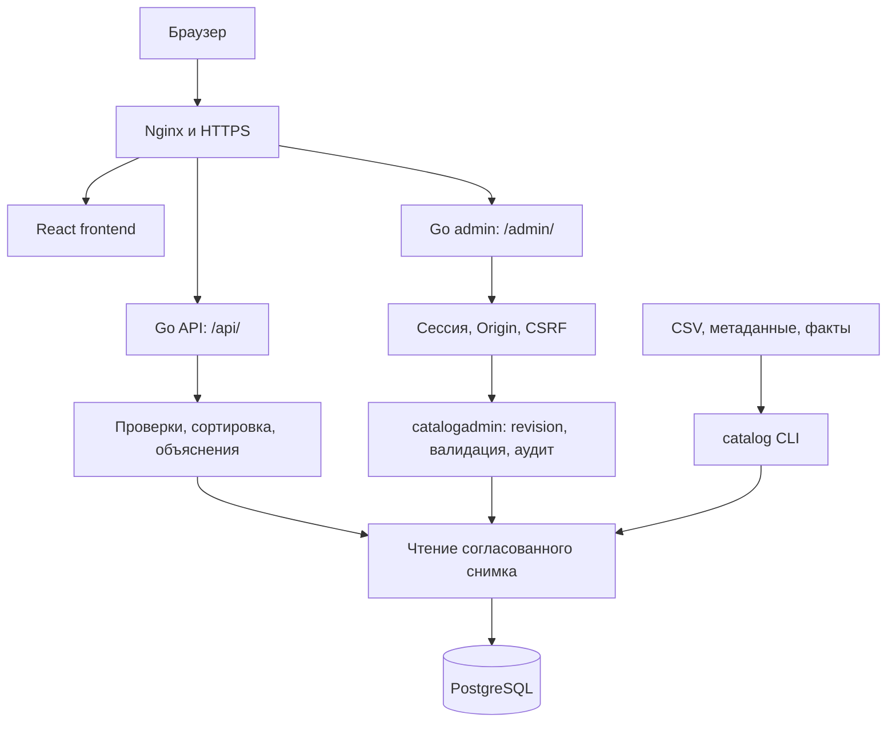

# HackAlem — архитектура Apex Match

Документ описывает опубликованную реализацию подбора и админ-панели на 23 сентября 2026 года. Требования и критерии приёмки: [TECH_SPEC.md](TECH_SPEC.md). Запуск: [README на английском](README.md) / [на русском](README.ru.md).

## 1. Компоненты и границы

Система состоит из публичного React-интерфейса, Go API подбора, отдельного Go-сервиса администрирования и общей PostgreSQL. Используются стандартный `net/http`, драйвер `pgx/v5` и типизированные модели. Админка содержит встроенные HTML/CSS/JavaScript и не зависит от сборки React.

Публичный API читает каталог и не содержит административных операций. Админка изменяет тот же каталог через общую библиотеку `backend/catalogadmin`. Бронирование, оплата, уведомления подрядчикам, пользовательские кабинеты заказчиков и внешние календари не реализованы. Онлайн-LLM не вызывается; объяснения собираются по шаблонам.

| Код | Ответственность |
|---|---|
| `backend/cmd/server` | Публичный HTTP-сервер |
| `backend/cmd/catalog` | CLI `check`, `migrate`, `import`, `bootstrap` |
| `backend/internal/domain` | Модели, нормализация Unicode, версии и коды причин |
| `backend/internal/catalog` | CSV, проверка снимка и доказательств |
| `backend/internal/matching` | Ограничения, воронка, порядок и объяснения |
| `backend/internal/postgres` | Миграции, согласованное чтение, атомарная замена и обновление |
| `backend/catalogadmin` | Общие правила ручного ввода/CSV, revision и запись аудита |
| `admin_panel/cmd/admin` | CLI `init`, `serve`, проверка окружения |
| `admin_panel/internal/app` | HTTP, авторизация, встроенный интерфейс и тесты |
| `frontend/src` | Форма, HTTP/mock адаптеры, проверка ответов Zod, карточки |

Go-модули backend и admin раздельные. В `admin_panel/go.mod` используется `replace ../backend`; для сборки нужны оба каталога рядом. Backend Compose запускает только БД, инициализацию каталога и публичный API. Админка запускается отдельно.

## 2. Источник данных и модель

Исходный CSV содержит 66 профилей, 17 категорий и 13 колонок. Эти числа описывают базовый датасет: после модерации число профилей и справочники могут измениться. Рабочий источник данных — PostgreSQL. Изменения в админке не переписывают файлы `backend/data/`.

Профиль содержит ID, имя, город, категории, форматы, языки, начальную цену, nullable `max_hours`, список занятых дат, описание и флаги `synthetic`, `price_imputed`, `city_imputed`. Списки CSV разделяются `|`; bool записывается как `True`/`False`; пустой `max_hours` означает `null`. Даты — строки `YYYY-MM-DD` в Go и элементы `date[]` в PostgreSQL, без преобразования часового пояса. Денежные значения — `int64` в тенге.

Для сравнения применяется Unicode NFC, схлопывание пробелов и case folding. В Go категории, форматы, языки и даты хранятся в срезах строк; загрузчик проверяет значения, удаляет повторы и сохраняет корректное отображаемое написание. ID в административных операциях ограничен шаблоном `^[A-Za-z0-9][A-Za-z0-9_-]{0,79}$` и не меняется при редактировании.

Календарное окно хранится явно: `2026-09-23`…`2026-12-31` включительно. Админка не расширяет его автоматически и не имеет отдельной формы редактирования окна. Отсутствие даты в списке занятых не является подтверждением бронирования.

### Фактическая схема PostgreSQL

| Таблица | Назначение |
|---|---|
| `schema_migrations` | Версии выполненных миграций backend |
| `vendors` | Текущий каталог: PK `id`, массивы категорий/форматов/языков, `busy_dates date[]`, цена, часы, флаги, описание |
| `catalog_state` | Одна строка `id=1`: JSONB `metadata` и `facts`, число профилей, хеш полного снимка, время загрузки |
| `admin_panel_users` | Имя пользователя, bcrypt-хеш пароля, флаг обязательной смены |
| `admin_panel_sessions` | SHA-256 хеш токена сессии, FK на пользователя, CSRF-токен, срок действия |
| `admin_panel_audit` | Автор, действие, ID профилей, revision до/после и время |

SQL backend встроен из `backend/internal/postgres/migrations/`. Таблицы админки создаются идемпотентной командой `admin init` из `admin_panel/internal/app/auth.go`. `init` не импортирует каталог и не меняет пароль существующего `admin`.

В БД хранится текущий снимок, а не история отдельных неизменяемых снимков. Аудит не хранит полное прежнее содержимое записи и не является механизмом отмены. Для восстановления нужны экспорт или резервная копия; CSV-экспорт содержит только профили, без фактов, пользователей, сессий и аудита.

### Версии и revision

- После CLI-импорта `snapshot_version` — SHA-256 исходных байтов CSV; `facts_version` — SHA-256 файла фактов либо `structured-only-v1`.
- После административной записи `snapshot_version` — SHA-256 CSV текущих профилей, сформированного `catalogadmin.CSV`; `facts_version` — SHA-256 JSON оставшихся фактов.
- `loader_version` и `policy_version` описывают преобразование и правила подбора.
- `revision` — SHA-256 JSON полного снимка: метаданные, профили и факты. Это отдельный токен конкурентного доступа, а не псевдоним `snapshot_version`.
- `GET /admin/api/vendors` и preview возвращают revision в JSON и `ETag`. Запись требует `If-Match` с этой revision.

## 3. Чтение и изменение каталога

### Публичное чтение

Каждый запрос получает весь текущий снимок в read-only транзакции `REPEATABLE READ`, проверяет число профилей, хеш и ограничения. Фильтрация по городу и категории выполняется в Go. CSV при HTTP-поиске не читается; постоянного кеша нет. Если БД недоступна или снимок нарушен, API возвращает `503 CATALOG_UNAVAILABLE`.

Запрос, начатый до изменения, может завершиться на прежнем согласованном снимке. Новый запрос после фиксации видит обновлённый каталог без перезапуска сервиса. Уже показанные карточки в браузере автоматически не обновляются — поиск нужно повторить.

### Полная замена через CLI

`catalog import` / `bootstrap` проверяют все входные файлы и заменяют каталог целиком одной транзакцией. Повторный импорт не создаёт дубли, но может перезаписать результаты модерации. Это операция первоначальной загрузки или осознанной замены, а не обязательный шаг обновления бинарников.

### Изменения через админку

1. Проверяются сессия, смена временного пароля, Origin и CSRF.
2. Ручной профиль или CSV проходят общий парсер backend; для файла проверяется лимит 5000 записей.
3. В транзакции берётся тот же advisory lock `79479002`, что у CLI-замены.
4. После получения блокировки читается актуальный снимок (`READ COMMITTED`) и сравнивается revision.
5. Применяется создание, полная замена полей записи, удаление или CSV-догрузка; каталог должен оставаться непустым.
6. Удаляются факты отсутствующих профилей и факты, хеш описания которых перестал совпадать. Новые факты автоматически не создаются.
7. Пересчитываются версии, проверяется снимок, записываются каталог и событие аудита.
8. Всё фиксируется одной транзакцией; ошибка откатывает каталог и аудит.

При устаревшей revision возвращается `409 REVISION_CONFLICT`; при отсутствии `If-Match` — `428 REVISION_REQUIRED`. Клиент обновляет данные и повторно предлагает действие пользователю. CLI использует блокировку, но не выполняет проверку `If-Match`; её полная замена может перезаписать изменения, сохранённые ранее.

### Preview и импорт CSV

Preview проверяет файл и возвращает число новых/существующих ID, список совпадений, первые 8 строк и revision. Он не пишет в БД, не хранит файл и не резервирует версию. Финальный запрос снова передаёт файл, который заново проверяется.

Без `update_existing=true` любой совпавший ID отклоняет весь импорт с `409 DUPLICATE_ID`. С флагом новые профили добавляются, совпавшие заменяются полностью. Записи, которых нет в файле, остаются. Это не частичное обновление полей и не удаление отсутствующих строк.

## 4. Подбор и объяснения

Проверяется JSON, обязательные поля и окно дат. Затем выбираются город/категория и последовательно применяются ограничения:

| Порядок | Код | Условие исключения |
|---|---|---|
| 1 | `EVENT_FORMAT_UNSUPPORTED` | Формат отсутствует в профиле |
| 2 | `BUDGET_TOO_LOW` | Стартовая цена выше бюджета |
| 3 | `LANGUAGE_UNSUPPORTED` | Заданный язык отсутствует в списке языков |
| 4 | `DURATION_EXCEEDED` | Заданные часы выше ненулевого лимита |
| 5 | `BUSY_ON_DATE` | Дата отмечена занятой |

Необязательные проверки пропускаются, когда язык/часы отсутствуют или равны `null`. Равенство цене/лимиту допустимо. Вычисляются все нарушения, но публичная воронка учитывает кандидата только на первом проваленном шаге.

Подходящие профили сортируются по `(price_from_kzt ASC, id ASC)`, возвращаются первые три. `sum(excluded_counts) + eligible_count = catalog_count`, `returned_count = min(eligible_count, 3)`. Четвёртый подходящий профиль не считается исключённым. Например, Буллма может пройти русский язык, но остаться четвёртой, а при английском попасть в выдачу.

Исходы: `NO_CATALOG` — нет профилей города/категории; `NO_MATCH` — профили есть, все исключены; `MATCHES_FOUND` — есть подходящие. Каждый исход имеет HTTP 200. Технический сбой не превращается в пустую бизнес-выдачу.

Объяснение использует поля профиля и подтверждённые цитатой факты из `catalog_state.facts`. Проверяются `review_status`, хеш описания и наличие цитаты. После удаления устаревшего факта используется объяснение по структурированным полям. Значение `approved` означает проверку соответствия исходному описанию, а не публикационный статус карточки. Отдельного процесса «черновик → одобрено» нет: сохранённые профили сразу участвуют в подборе.

Онлайн-LLM, отдельного сервиса извлечения фактов и кеша объяснений нет. Цена «от» не является сметой; условия из описания, не поддержанные фильтрами, передаются как `conditions_to_confirm`.

## 5. Авторизация админки

`admin init` создаёт пользователя `admin` со случайным временным паролем (или переданным `ADMIN_INITIAL_PASSWORD`). Общего стандартного пароля нет. До смены временного пароля доступны только session/logout/password. Новый пароль должен отличаться, содержать минимум 12 символов и не превышать 72 байта; используется bcrypt. Смена пароля отзывает все сессии.

Cookie `hackalem_admin_session` имеет Path `/admin`, HttpOnly, SameSite=Strict, Secure в production и срок 8 часов. В БД хранится SHA-256 токена сессии. Изменяющие запросы требуют точный `Origin`; авторизованные запросы на изменение также требуют `X-CSRF-Token`. Логин требует Origin, но ещё не требует CSRF. CORS публичного API не заменяет эти проверки.

Логин и смена пароля ограничены отдельными счётчиками: 10 попыток за 15 минут на IP, счётчики в памяти процесса. При `ADMIN_TRUST_PROXY=true` заголовок `X-Real-IP` принимается только от loopback; Nginx перезаписывает его. Несколько ролей, управление пользователями, MFA и восстановление пароля через email не реализованы.

## 6. HTTP и ограничения

| Группа | Маршруты | Доступ |
|---|---|---|
| Публичный подбор | `/api/recommendations`, `/api/catalog/meta` | Без авторизации |
| Админ-интерфейс | `/admin/`, `/admin/app.js`, `/admin/style.css` | Страница доступна без сессии; данные защищены |
| Сессии | `/admin/api/login`, `/session`, `/logout`, `/password` (общий префикс `/admin/api`) | По правилам выше |
| Каталог | `/admin/api/vendors`, `/vendors/{id}`, `/import/preview`, `/import`, `/export`, `/template` | Сессия, сменённый пароль; защита записи |
| Аудит | `/admin/api/audit` | Сессия, последние 50 событий |
| Служебные | `/healthz`, `/readyz`, `/metrics` backend; `/readyz` admin | Локальные порты; публично настроен только alias `/api/health` backend |

Публичное тело JSON ограничено 64 КиБ, административное — 512 КиБ. Multipart админки — до 5 МиБ; Nginx допускает 6 МиБ, а приложение применяет свой меньший предел. CSV-ошибки не приводят к частичной загрузке. Readiness админки требует доступную БД, хотя бы одного пользователя и целый каталог.

Полные контракты: [публичный API](backend/ENDPOINT.MD), [административный API](admin_panel/ENDPOINT.MD). Форматы ошибок различаются: публичный `{error:{code,details}}`, административный `{error:{code,message}}`.

## 7. Развёртывание и наблюдаемость

В production Nginx раздаёт React build, направляет `/api/` на `127.0.0.1:18080` и `/admin/` на `127.0.0.1:18081`. `location ^~ /admin/` сохраняет префикс пути и не отдаёт SPA вместо административного API. HTTPS, ACME и редиректы сохраняются при обновлении любого компонента.

Systemd-сервисы: `hackalem-backend` и `hackalem-admin`; общий пользователь ОС `hackalem` и база PostgreSQL. Админка не имеет публичного отдельного порта. Конфигурация — `/etc/hackalem/backend.env` и `/etc/hackalem/admin.env`. Порядок первого запуска: БД → миграции/исходный импорт → `admin init` → сервисы → Nginx.

Публичный backend пишет JSON-логи с request ID, HTTP-статусом, длительностью, версиями и итогами подбора. `/metrics` содержит HTTP-счётчики и p50/p95 последних 1024 завершённых запросов; значения сбрасываются при рестарте. Админка возвращает `X-Request-ID`, пишет ошибки в журнал сервиса, а изменения каталога и пароля — в таблицу аудита. Это не полный аудит просмотров или входов.

Релизы frontend, backend и admin имеют отдельные `current`-ссылки. Обновление админки не требует импорта исходного CSV. Откат бинарника не отменяет изменения в БД. Полный `pg_dump` сохраняет профили, метаданные, факты, пользователей, сессии и аудит; такой архив отличается от CSV-экспорта и хранится с ограниченным доступом. Инструкция: [admin_panel/deploy/README.md](admin_panel/deploy/README.md).

## 8. Проверка и ограничения интерфейса

Базовые сценарии подбора относятся к исходным 66 профилям; после модерации ожидания по ID и количеству зависят от версии данных. Проверки backend описаны в [backend/TESTING.md](backend/TESTING.md), админки — в [admin_panel/TESTING.md](admin_panel/TESTING.md).

Сценарии админки проверяют авторизацию, принудительную смену пароля, CSRF/Origin, CRUD, preview без записи, отказ импорта совпавших ID, явное обновление, удаление устаревших фактов, экспорт, аудит, конфликт двух изменений и запрет удаления последней записи. Для интеграционных тестов необходим `TEST_DATABASE_URL`; тесты создают собственную схему.

В публичном frontend пока встроенные справочники формы: добавленная администратором категория/город появится в API meta, но для выбора в форме потребуется обновление frontend. Список в админке загружается целиком, поиск/фильтры выполняются на клиенте. Пагинация, отложенная публикация, отмена по аудиту, автоматическое извлечение новых фактов и управление ролями остаются за пределами текущей реализации.
